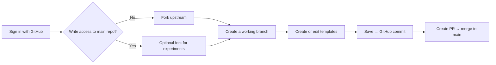

# ComfyUI Template Admin

A modern web-based admin interface for managing ComfyUI workflow templates. This application allows you to browse, search, create, and manage workflow templates for ComfyUI with GitHub integration.

## User Guide

This guide is for **template maintainers** using the deployed admin app to browse, edit, and commit changes to the [`Comfy-Org/workflow_templates`](https://github.com/Comfy-Org/workflow_templates) repository on GitHub.

### Recommended workflow



### 1. Repository and branch

The app works against **`Comfy-Org/workflow_templates`** on GitHub (no local copy of template files). All edits are commits on the remote repo using your GitHub account.

#### 1.1 Sign in and fork

1. Open the deployed admin URL and click **Sign in with GitHub**.
2. In the left sidebar, open **Repository & Branch**:
   - If you **do not** have write access to the main repo: click **Create Fork** to fork `Comfy-Org/workflow_templates` to your account.
   - If you already have a fork: select it in the **Repository** dropdown (`your-username/workflow_templates`).
3. When your fork is behind upstream, use **Sync Fork**. If histories have diverged, **Advanced Options** offers merge sync, Save & Reset, or Force Reset (use force reset with care).

#### 1.2 Create and switch branches

Next to **Branch**, click **New**:

1. Enter a branch name (e.g. `feature/short-description` or `update/template_name`).
2. Choose the base branch (usually `main`).
3. After creation, the app switches to the new branch automatically.

**Recommendation:** Do all template work on a **feature branch** and merge via PR. Avoid editing `main` directly when possible.

| Scenario | Suggested flow |
|----------|----------------|
| First contribution | Fork → new branch from `main` → edit → **Create PR** |
| Team with main-repo access | Still prefer branch + PR |
| Review someone’s PR | **Browse PRs** → select PR → read-only PR branch view |

Selected repo and branch are stored in browser `localStorage` and restored on the next visit.

### 2. Browse and filter templates

On the home page (`/`):

- **Category sidebar** — filter by category.
- **Search** — match name, title, or description.
- **Filters** — model, tag, runs on (API / open source), diff status vs `main` (new / modified / deleted), missing thumbnails, and more.
- **Sort** — default order, latest, oldest, usage, or name.

Click a template card for details; on a writable branch you can open the editor.

**Branch diff:** When the selected branch is not `main`, the sidebar shows change counts vs `main` to help scope your PR.

### 3. Create a template

**Entry:** Sign in, select a writable branch → **Create Template** → `/admin/edit/new`.

#### 3.1 Steps

1. **Upload workflow JSON** (WorkflowFileManager)
   - Upload `workflow.json`; nodes are parsed and validated.
   - Missing **input files** referenced by `LoadImage`, `LoadAudio`, `LoadVideo`, etc. are highlighted; upload and convert them in place.
   - A suggested **template name** may be inferred from the workflow (must follow [naming rules](#35-naming-conventions)).
2. Fill in **Template Details** (see [required fields](#32-required-and-optional-fields)).
3. Configure **thumbnails** ([section 3.3](#33-thumbnails)).
4. Optionally use **Category Order** on the left to set position within the category.
5. Click **Create Template** — one commit to GitHub (`templates/index.json`, workflow, thumbnails, input files, and locale index sync).

After success you return to the home page. If the edit page says “not found”, wait a moment for GitHub/CDN cache to update.

#### 3.2 Required and optional fields

| Field | Create | Edit | Notes |
|-------|:------:|:----:|-------|
| Workflow file | ✅ | — | Required when creating |
| Template name | ✅ | — | `snake_case`; see [naming](#35-naming-conventions) |
| Title | ✅ | ✅ | English; triggers i18n sync |
| Description | ✅ | ✅ | English |
| Category | ✅ | ✅ | Category and name-prefix hints |
| Thumbnail(s) | ✅ | ✅ | Count depends on thumbnail effect |
| Tags | ✅ | ✅ | At least one |
| Models | ✅ | ✅ | At least one |
| Date | ✅ | ✅ | Publish/update date |
| Model size (GB) | ✅ | ✅ | `0` is allowed |
| Open source | ✅ | ✅ | Whether it runs on open-source stack |
| Creator | ✅ | ✅ | e.g. GitHub username |
| Tutorial URL | — | Optional | |
| VRAM (GB) | — | Optional | |
| ComfyUI version | — | Optional | |
| Custom nodes | — | Optional | Can be detected from workflow |
| Model links | — | Optional | Download URLs in the workflow |
| Thumbnail effect | — | Optional | See [thumbnails](#33-thumbnails) |

The **Required Fields** progress bar and **Missing** list update as you type.

#### 3.3 Thumbnails

- **Format:** WebP recommended. **Thumbnail Converter** supports image/video → WebP, crop, and compress (aim for images &lt;100KB, videos &lt;1MB).
- **Thumbnail effect:**
  - `none` / `zoomHover` — 1 image
  - `hoverDissolve` / `compareSlider` — 2 images (before/after or hover dissolve)
- **Template Card Preview** on the right shows the card in real time.

#### 3.4 What gets committed

A single save typically updates:

- `templates/index.json` (metadata and order within categories)
- `templates/<template_name>.json` (workflow)
- `templates/thumbnails/<name>.webp` (and `-2`, etc. for multi-image variants)
- Missing files under `input/`
- **12 locales** — `templates/index.<locale>.json` auto-sync (English placeholders on create; existing translations preserved on update)
- `i18n.json` **outdated_translations** when English title/description change ([details](./docs/i18n-outdated-translations.md))

#### 3.5 Naming conventions

Rules live in `config/template-naming-rules.json`. The editor suggests a prefix from **Category**:

| Category (examples) | Prefix | Example name |
|---------------------|--------|--------------|
| Image / Use cases | `image_` | `image_portrait_lighting` |
| Video | `video_` | `video_animation_workflow` |
| API | `api_` | `api_text_to_image` |
| Getting Started | `gs_` | `gs_first_workflow` |
| Utility | `utility_` | `utility_batch_processor` |

Use **lowercase + underscores**, no spaces or hyphens; keep names under ~50 characters.

### 4. Edit a template

**Entry:** On a writable branch, click a template card → `/admin/edit/<template_name>`.

Same form as create, plus:

- Replace or download workflow and input files
- Update metadata, thumbnails, and model links
- **AI Assist Batch** (when enabled on the deployment) — draft title, description, tags, etc.

**Save** is disabled when there are no changes or required fields are incomplete. Success shows a link to the commit SHA.

### 5. Reorder templates within a category

The **Category Order** sidebar on the edit page changes template order inside the current category in `index.json` (ComfyUI template list order).

| Action | Description |
|--------|-------------|
| **Drag** | Reorder entries; the template you are editing is marked **Current** |
| **Sort by usage** | Sort by `usage` descending |
| **Restore order** | Revert to order loaded from GitHub when the page opened |
| **Refresh** | Reload order from remote (discards unsaved reorder draft) |

Reorder is saved with the template: the API writes `templateOrder` to `templates/index.json` and syncs locale index files.

> Reorder-only saves still create a commit; the message may include `(reorder)`.

### 6. Bulk tools on the home page

When signed in on a writable branch:

| Tool | Purpose |
|------|---------|
| **Translations** | Edit title/description across 12 languages; optional AI per field |
| **Tags & Models** | Review and clean up tags and model references across templates |
| **Creators** | Batch-assign creators |
| **Update Usage** | Import `usage` from CSV (works with **Sort by usage**) |
| **Create Template** | New template wizard |
| **Browse PRs** | List PRs and switch to PR branch (read-only) |
| **Create PR** | Open a PR to upstream when your branch has commits ahead of `main` |

**Local Settings** (gear) — local ComfyUI paths for preview; not written to GitHub.

### 7. Commits and pull requests

1. Complete edits on your fork’s branch; each **Save** is one commit.
2. On the home page, confirm branch diff stats vs `main`.
3. Click **Create PR** toward `Comfy-Org/workflow_templates` → `main`.
4. After merge, **Sync Fork** to refresh your fork.

If the PR branch is behind its base, **Update** merges upstream into the PR branch.

### 8. i18n and translations

- **Auto-sync:** Saving syncs technical fields and English copy to locale files (`en`, `zh`, `zh-TW`, `ja`, `ko`, `es`, `fr`, `ru`, `tr`, `ar`, `pt-BR`, `fa`).
- **Outdated markers:** Changing only English title/description does not overwrite other languages but flags entries in `i18n.json` → `outdated_translations`.
- **Manual / AI translation:** Use **Translations** on the home page (AI assist is available when enabled on the deployment).

See [i18n outdated translations](./docs/i18n-outdated-translations.md).

### 9. Permissions and read-only mode

| State | Behavior |
|-------|----------|
| Not signed in | Browse only; no create/edit/save |
| Viewing a PR branch | Purple **Browsing PR Branch** banner; editing disabled |
| No write access | Blue **Read-only mode**; fork or switch branch |
| `main` (team policy) | Direct edits may be blocked; use a feature branch |

The edit page shows **Read-Only Mode** and `repo @ branch` when applicable.

### 10. FAQ

**Template not found right after save?**  
GitHub/CDN cache lag — wait and refresh, or reopen from the home page.

**Create Template / Save disabled?**  
Sign in, select a writable fork/branch, exit PR browse mode, and complete required fields.

**Input file warnings?**  
Referenced files must exist under `input/` in the repo; upload them in the Workflow section.

**Slow video thumbnail conversion?**  
First run downloads FFmpeg.wasm (~31MB); that is expected.

---

## Features

- **Template Management**: Browse, search, and filter ComfyUI workflow templates
- **GitHub Integration**:
  - OAuth authentication with GitHub
  - Fork and branch management
  - Multi-repository support
  - Diff detection between branches
  - Direct PR creation
- **Template Creation**: Upload and configure new workflow templates with:
  - Workflow JSON files
  - Thumbnail images (multiple formats supported)
  - Model embedding
  - Metadata management
- **Advanced Filtering**:
  - Search by name, title, or description
  - Filter by category, model, tags, and type
  - Sort by date or name
- **AI Translation (Optional)**:
  - DeepSeek API integration for automated translation
  - One-click translation for individual fields
  - Built-in security with rate limiting and whitelist
  - Configurable prompts and settings
- **Modern UI**: Built with Shadcn UI components and Tailwind CSS
- **Type-Safe**: Full TypeScript support
- **Testing**: Comprehensive test coverage with Vitest

## Tech Stack

- **Framework**: [Nuxt 3](https://nuxt.com/)
- **UI Library**: [Vue 3](https://vuejs.org/)
- **Language**: TypeScript
- **Styling**: [Tailwind CSS](https://tailwindcss.com/)
- **Components**: [Shadcn UI](https://www.shadcn-vue.com/) with [Reka UI](https://reka-ui.com/)
- **Authentication**: [NextAuth.js](https://next-auth.js.org/) via [@sidebase/nuxt-auth](https://sidebase.com/nuxt-auth)
- **GitHub API**: [@octokit/rest](https://github.com/octokit/rest.js)
- **Testing**: [Vitest](https://vitest.dev/)
- **Validation**: [Zod](https://zod.dev/)

## Prerequisites

- Node.js 18+
- npm or yarn
- GitHub account (for authentication and integration)
- GitHub OAuth App credentials (for production deployment)

## Installation

### 1. Clone the repository

```bash
git clone <repository-url>
cd ComfyUI_Template_Manager
```

### 2. Install dependencies

```bash
npm install
```

### 3. Configure environment variables

Copy the example environment file:

```bash
cp .env.example .env
```

Edit `.env` with your configuration:

```env
# NextAuth Configuration
NEXTAUTH_SECRET=your-random-secret-here  # Generate with: openssl rand -base64 32
NEXTAUTH_URL=http://localhost:3000/api/auth

# GitHub OAuth App
GITHUB_CLIENT_ID=your-github-oauth-client-id
GITHUB_CLIENT_SECRET=your-github-oauth-client-secret

# AI Translation (Optional - uncomment to enable)
# DEEPSEEK_API_KEY=sk-xxxxx
# DEEPSEEK_API_ENDPOINT=https://api.deepseek.com/v1/chat/completions
# DEEPSEEK_MODEL=deepseek-chat
```

**Note**: `GITHUB_TOKEN` is NOT required. All GitHub operations use the user's OAuth token obtained during sign-in.

**AI Translation (Optional)**: To enable AI-powered translation, set `DEEPSEEK_API_KEY`. See [AI Translation Setup](#ai-translation-optional) for details.

### 4. Run development server

```bash
npm run dev
```

The application will be available at `http://localhost:3000`

## GitHub OAuth Setup

To enable GitHub authentication:

1. Go to [GitHub Settings → Developer settings → OAuth Apps](https://github.com/settings/developers)
2. Click "New OAuth App"
3. Configure the OAuth App:
   - **Application name**: ComfyUI Template Manager (or your preferred name)
   - **Homepage URL**:
     - Development: `http://localhost:3000`
     - Production: `https://your-domain.vercel.app`
   - **Authorization callback URL**:
     - Development: `http://localhost:3000/api/auth/callback/github`
     - Production: `https://your-domain.vercel.app/api/auth/callback/github`
4. Click "Register application"
5. Copy the **Client ID**
6. Click "Generate a new client secret" and copy the **Client Secret**
7. Add these to your `.env` file (locally) or Vercel environment variables (production)

**Required OAuth Scopes**: The app automatically requests `read:user`, `user:email`, and `public_repo` permissions during sign-in.

## Available Scripts

- `npm run dev` - Start development server
- `npm run build` - Build for production
- `npm run generate` - Generate static site
- `npm run preview` - Preview production build
- `npm run test` - Run tests
- `npm run type-check` - Run TypeScript type checking
- `npm run lint` - Run ESLint
- `npm run lint:fix` - Fix ESLint errors
- `npm run setup:github` - Setup GitHub integration

## Project Structure

```
template_cms/
├── assets/              # CSS and static assets
├── components/          # Vue components
│   └── ui/             # Shadcn UI components
├── composables/        # Vue composables
├── docs/               # Documentation
├── lib/                # Utility functions
├── pages/              # Nuxt pages (routes)
├── public/             # Public static files
├── scripts/            # Build and setup scripts
├── server/             # Nuxt server API routes
│   └── api/           # API endpoints
├── test/               # Test files
├── nuxt.config.ts      # Nuxt configuration
├── tailwind.config.js  # Tailwind CSS configuration
└── tsconfig.json       # TypeScript configuration
```

## Documentation

- **[User Guide](#user-guide)** — templates, reordering, bulk tools, and PR workflow (in this README)
- [i18n outdated translations](./docs/i18n-outdated-translations.md) — multi-language sync and translation maintenance
- [Branch comparison](./docs/branch-comparison.md) — branch diff and PR browsing
- [AI translation security quickstart](./docs/SECURITY-QUICKSTART.md) — for operators enabling AI translation on a deployment

## AI Translation (Optional)

The application includes an optional AI-powered translation feature using the DeepSeek API. This feature helps translate template metadata across multiple languages.

### Features

- **One-Click Translation**: Translate individual fields with a single click
- **Multiple Languages**: Support for 12 languages (en, zh, zh-TW, ja, ko, es, fr, ru, tr, ar, pt-BR, fa)
- **Security Protection**:
  - Rate limiting (20 requests/minute per user)
  - Origin verification (auto-detects from `NEXTAUTH_URL`)
  - GitHub authentication required
  - Whitelist support for trusted users
- **Real-Time Feedback**: Shows loading state and translation status
- **Configurable**: All prompts and settings in `config/i18n-config.json`

### Setup

#### Step 1: Get DeepSeek API Key

1. Sign up at [DeepSeek Platform](https://platform.deepseek.com/)
2. Navigate to API Keys section
3. Create a new API key
4. Copy the key (starts with `sk-`)

#### Step 2: Configure Environment Variables

Add to your `.env` file:

```bash
DEEPSEEK_API_KEY=sk-xxxxx
DEEPSEEK_API_ENDPOINT=https://api.deepseek.com/v1/chat/completions  # Optional
DEEPSEEK_MODEL=deepseek-chat  # Optional
```

#### Step 3: Configure Security Settings

Edit `config/i18n-config.json`:

```json
{
  "aiTranslation": {
    "security": {
      "rateLimit": {
        "enabled": true,
        "maxRequestsPerMinute": 20
      },
      "originCheck": {
        "enabled": true,
        "allowedOrigins": []  // Empty = auto-use NEXTAUTH_URL
      },
      "whitelist": {
        "users": ["your-github-username"]  // Add your username for unlimited access
      }
    }
  }
}
```

#### Step 4: Restart Server

```bash
npm run dev
```

### Security Configuration

#### Rate Limiting

By default, each user is limited to 20 translation requests per minute. This prevents API abuse and controls costs.

**To adjust the limit:**

```json
{
  "aiTranslation": {
    "security": {
      "rateLimit": {
        "maxRequestsPerMinute": 50  // Increase or decrease as needed
      }
    }
  }
}
```

#### Origin Verification

The system automatically allows requests only from your configured domain (extracted from `NEXTAUTH_URL`).

**For multiple domains** (development + staging + production):

```json
{
  "aiTranslation": {
    "security": {
      "originCheck": {
        "enabled": true,
        "allowedOrigins": [
          "http://localhost:3000",
          "https://staging.yourdomain.com",
          "https://yourdomain.com"
        ]
      }
    }
  }
}
```

#### Whitelist for Trusted Users

Users in the whitelist bypass all rate limits and have unlimited translation access.

**To add users to whitelist:**

1. Get their GitHub username (visible when they sign in)
2. Add to `config/i18n-config.json`:

```json
{
  "aiTranslation": {
    "security": {
      "whitelist": {
        "users": [
          "admin-username",
          "trusted-translator-1",
          "trusted-translator-2"
        ]
      }
    }
  }
}
```

### Usage

1. **Access Translation Manager**:
   - Navigate to `/admin/i18n`
   - Or click "Manage Translations" in the admin panel

2. **Translate a Field**:
   - Click "Edit" on any cell (non-English language)
   - Click the purple lightbulb icon (AI translate button)
   - Review the AI-generated translation
   - Modify if needed and click "Save"

3. **Modified Cell Tracking**:
   - Recently translated/edited cells show a green border
   - This helps track which fields you've updated

### Error Messages

- **"Rate limit exceeded"**: You've exceeded the request limit. Wait 1 minute or add yourself to the whitelist.
- **"Request origin not allowed"**: Check that `NEXTAUTH_URL` is correctly configured.
- **"Unauthorized"**: Sign in with GitHub first.

### Cost Considerations

- DeepSeek API pricing: ~$0.14 per 1M input tokens, ~$0.28 per 1M output tokens
- Average translation (50 words): ~100 tokens ≈ $0.00003 per translation
- With default rate limit (20/min): Maximum ~$0.0006 per user per minute
- Whitelist users can bypass limits, so monitor their usage

### Documentation

- **Quick Start**: See `SECURITY-QUICKSTART.md`
- **Detailed Guide**: See `TODO-i18n-sync.md`
- **Configuration**: All settings in `config/i18n-config.json`

### Disable AI Translation

To disable the feature:

1. Remove or comment out `DEEPSEEK_API_KEY` from `.env`
2. Restart the server

The AI translate button will automatically disappear from the UI.

---

## Testing

Run the test suite:

```bash
npm run test
```

Run tests in watch mode:

```bash
npm run test -- --watch
```

Run tests with coverage:

```bash
npm run test -- --coverage
```

## Deployment

### Deploy to Vercel (Recommended)

#### Step 1: Prepare Your GitHub OAuth App

Before deploying, create a GitHub OAuth App with your production URL:

1. Go to [GitHub OAuth Apps](https://github.com/settings/developers)
2. Create a new OAuth App or update existing one
3. Set **Authorization callback URL** to: `https://your-domain.vercel.app/api/auth/callback/github`
   - You can use Vercel's auto-generated domain (e.g., `your-project.vercel.app`)
   - Or configure a custom domain later

#### Step 2: Deploy to Vercel

**Option A: Using Vercel Dashboard (Recommended)**

1. Go to [vercel.com](https://vercel.com) and sign in
2. Click "Add New Project"
3. Import your GitHub repository
4. Configure project settings:
   - **Framework Preset**: Nuxt.js (auto-detected)
   - **Build Command**: `npm run build` (auto-detected)
   - **Output Directory**: `.output/public` (auto-detected)
   - **Install Command**: `npm install` (auto-detected)
5. Add environment variables:
   - `GITHUB_CLIENT_ID` - Your OAuth App Client ID
   - `GITHUB_CLIENT_SECRET` - Your OAuth App Client Secret
   - `NEXTAUTH_SECRET` - Generate with `openssl rand -base64 32`
   - `NEXTAUTH_URL` - `https://your-domain.vercel.app/api/auth`
6. Click "Deploy"

**Option B: Using Vercel CLI**

```bash
# Install Vercel CLI
npm install -g vercel

# Login to Vercel
vercel login

# Deploy to production
vercel --prod
```

#### Step 3: Update Environment Variables

After deployment, update `NEXTAUTH_URL` in Vercel:

1. Go to your project settings in Vercel
2. Navigate to "Environment Variables"
3. Update `NEXTAUTH_URL` to your actual domain: `https://your-actual-domain.vercel.app/api/auth`
4. Redeploy the project

#### Step 4: Update GitHub OAuth App

Update your GitHub OAuth App callback URL to match your deployed domain:

1. Go to [GitHub OAuth Apps](https://github.com/settings/developers)
2. Edit your OAuth App
3. Update **Authorization callback URL** to: `https://your-actual-domain.vercel.app/api/auth/callback/github`
4. Save changes

### Troubleshooting Vercel Deployment

#### Issue: 404 Error or Page Not Found

**Symptoms**: When you visit your deployed site, you see a 404 error or "Page Not Found" message.

**Solution**:

1. **Do NOT use `vercel.json`** - Vercel has built-in support for Nuxt 3 and will automatically detect it
2. If you have a `vercel.json` file, delete it: `rm vercel.json`
3. Make sure your `nuxt.config.ts` has `ssr: true` (already configured)
4. Verify environment variables are set correctly in Vercel dashboard
5. Check build logs in Vercel for any errors
6. Redeploy after removing `vercel.json`

**Note**: For Nuxt 3, Vercel automatically:
- Detects the framework
- Uses the correct build command (`npm run build`)
- Configures the output directory (`.output`)
- Sets up serverless functions for SSR

#### Issue: Environment Variables Not Working

**Symptoms**: OAuth fails, or you see "Unauthorized" errors.

**Solution**:

1. Double-check all 4 environment variables are set in Vercel dashboard
2. Make sure `NEXTAUTH_URL` includes `/api/auth` at the end
3. Verify GitHub OAuth callback URL matches your Vercel domain exactly
4. Redeploy after changing environment variables

#### Issue: OAuth Redirect Fails

**Symptoms**: After clicking "Sign in with GitHub", you get a redirect error.

**Solution**:

1. Verify GitHub OAuth App callback URL is: `https://your-domain.vercel.app/api/auth/callback/github`
2. Make sure `NEXTAUTH_URL` in Vercel is: `https://your-domain.vercel.app/api/auth`
3. Both URLs must match your actual Vercel domain
4. Use `https://` (not `http://`) for production

#### Issue: Build Fails

**Symptoms**: Deployment fails during build process.

**Solution**:

1. Check build logs in Vercel dashboard
2. Verify all dependencies are in `package.json`
3. Make sure Node.js version is 18+ (configured in Vercel project settings)
4. Try building locally first: `npm run build`

### Other Deployment Platforms

For deployment to other platforms (Netlify, AWS, etc.), see [Deployment Guide](./docs/deployment.md) (if available).

### Local Production Build

Test the production build locally before deploying:

```bash
# Build for production
npm run build

# Preview production build
npm run preview
```

## Contributing

We welcome contributions! Please see [Contributing Guide](./docs/contributing.md) for details.

## License

This project is licensed under the MIT License.

## Support

For issues and questions:
- Create an issue on GitHub
- Check existing documentation in `/docs`

## Acknowledgments

- [ComfyUI](https://github.com/comfyanonymous/ComfyUI) - The amazing UI for Stable Diffusion
- [Shadcn UI](https://ui.shadcn.com/) - Beautiful component library
- [Nuxt 3](https://nuxt.com/) - The Intuitive Vue Framework
